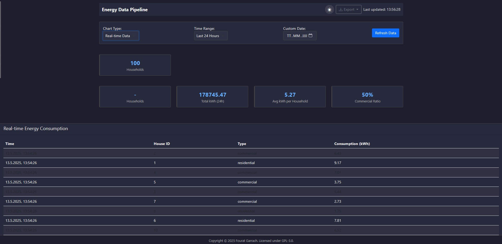
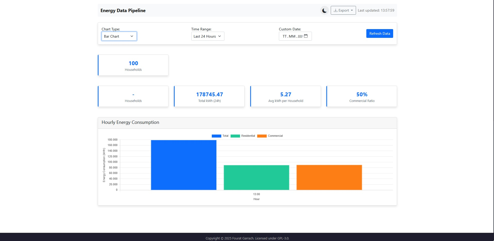

# Energy Data Processing Pipeline

A scalable data processing pipeline for energy consumption data analysis, visualization, and reporting. Can be deployed on Kubernetes or as a standalone Flask application, with both Flask and React dashboard options.

## Dashboard Screenshots

### Dark Mode View


### Light Mode View


## System Architecture

The system consists of interconnected components that work together to process and visualize energy consumption data:


## Kubernetes Deployment

All components are containerized and deployed on Kubernetes, with horizontal scaling for data processors:


## Overview

This project simulates a real-world energy data processing system that could be used by utility companies like E.ON to monitor, analyze, and visualize energy consumption patterns. The system processes energy consumption data from multiple households in real-time, providing insights through interactive dashboards.

## Architecture

The system consists of the following components:

- **Data Generator**: Simulates IoT devices sending energy consumption data
- **RabbitMQ**: Message queue for reliable data transfer between components
- **Data Processor**: Analyzes incoming data with horizontal scaling capabilities
- **Persistent Storage**: Stores processed data for historical analysis
- **Dashboards**: 
  - Flask-based web UI with visualization capabilities
  - React-based modern interactive dashboard with enhanced features

## Features

- **Scalable Processing**: Horizontal Pod Autoscaler automatically scales based on workload
- **Real-time Analytics**: Processes and visualizes data as it arrives
- **Interactive Dashboards**: 
  - Multiple chart types, time range selection, and filtering options
  - Choice between Flask-based or React-based UI
- **Dark/Light Mode**: User-friendly interface with theme support (React dashboard)
- **Data Export**: Generate reports in CSV and PDF formats
- **Persistent Storage**: Historical data is retained across pod restarts

## Technologies Used

- **Kubernetes**: Container orchestration
- **Docker**: Containerization
- **Python**: Backend processing with Flask
- **React**: Modern frontend framework for enhanced UI
- **RabbitMQ**: Message queuing
- **SQLite**: Data storage
- **Chart.js**: Data visualization
- **Bootstrap**: Responsive UI framework

## Getting Started

### Prerequisites

- Docker Desktop with Kubernetes enabled
- kubectl command-line tool
- Helm (optional)

### Deployment

1. **Clone the repository**
   ```bash
   git clone https://github.com/Tayer007/realtime-energy-monitor.git
   cd energy-data-pipeline
   ```

2. **Build and push Docker images**
   ```bash
   # Update with your Docker Hub username
   ./build-images.bat
   ```

3. **Deploy to Kubernetes**
   ```bash
   ./deploy.bat
   ```

4. **Access the Flask dashboard**
   ```bash
   kubectl port-forward svc/dashboard 8081:80
   ```
   Then open your browser at http://localhost:8081

5. **Deploy and access the React dashboard (optional)**

   The React dashboard communicates with the Flask backend via CORS. Ensure the Flask dashboard is running and accessible before deploying the React dashboard.
   
   #### Setup React Dashboard from Scratch:
   
   ```bash
   # Create React app - make sure to name it react-dashboard to avoid conflicts
   npx create-react-app react-dashboard
   cd react-dashboard
   
   # Install necessary dependencies
   npm install axios chart.js react-chartjs-2 bootstrap react-bootstrap react-icons jspdf jspdf-autotable
   
   # Copy React component files from the repository
   # Replace files in src/ with the ones from the repository's react-dashboard/src/ directory
   # Create the Dockerfile and nginx.conf in the root of the react-dashboard directory
   
   # Build and deploy (after setting up all files)
   ./build-react.bat
   ./deploy-react.bat
   kubectl port-forward svc/react-dashboard 3000:80
   ```
   
   Then open your browser at http://localhost:3000
   
   **Important**: The React dashboard requires the Flask backend to be running and accessible. It retrieves data via API calls to the Flask server, so make sure port forwarding is active for the Flask dashboard (on port 8081) before accessing the React dashboard.

## Components Breakdown

### Data Generator

Python service that generates simulated energy consumption data for both residential and commercial properties. Consumption patterns vary by time of day to simulate real-world usage.

### Message Queue (RabbitMQ)

Provides reliable message delivery between the generator and processor, allowing the system to handle high volumes of data and ensuring no data loss during processing.

### Data Processor

Analyzes incoming energy data, calculating metrics such as:
- Total consumption by time period
- Residential vs. commercial usage ratios
- Average consumption per household
- Time-based consumption patterns

The processor automatically scales based on workload using Kubernetes' Horizontal Pod Autoscaler.

### Dashboards

Interactive visualization interface with multiple views and themes:
- Real-time consumption monitoring
- Multiple visualization options (line, bar, area charts)
- Time range filtering
- Light/dark theme support
- Data export capabilities (CSV/PDF)

The dashboard communicates with the backend through API calls, utilizing CORS (Cross-Origin Resource Sharing) to handle cross-domain requests.

## Project Structure

```
energy-data-pipeline/
├── data-generator/         # Data simulation component
│   ├── app.py
│   ├── Dockerfile
│   └── requirements.txt
├── data-processor/         # Data analysis component
│   ├── app.py
│   ├── Dockerfile
│   └── requirements.txt
├── dashboard/              # Flask Web UI component
│   ├── app.py
│   ├── Dockerfile
│   ├── requirements.txt
│   └── templates/
│       └── index.html
├── react-dashboard/        # React Web UI component
│   ├── public/
│   ├── src/
│   │   ├── components/     # React components
│   │   ├── contexts/       # Context providers
│   │   ├── services/       # API services
│   │   ├── App.js
│   │   └── App.css
│   ├── Dockerfile
│   └── nginx.conf
├── kubernetes/             # Kubernetes configuration
│   ├── dashboard-deployment.yaml
│   ├── generator-deployment.yaml
│   ├── persistent-volume.yaml
│   ├── processor-deployment.yaml
│   ├── rabbitmq.yaml
│   └── react-dashboard-deployment.yaml
├── build-images.bat        # Script to build Docker images
├── deploy.bat              # Script to deploy to Kubernetes
├── build-react.bat         # Script to build React Docker image
├── deploy-react.bat        # Script to deploy React dashboard
└── README.md
```

## Deployment Options

### Kubernetes Deployment (What I Used)

I personally built and deployed this system using Kubernetes for container orchestration, which provides benefits like automatic scaling, self-healing, and simplified deployment. Follow the instructions in the "Getting Started" section to deploy with Kubernetes.

### Flask-only Deployment (Simpler Alternative)

If you prefer a simpler setup without Kubernetes, you can run each component directly:

1. **Set up RabbitMQ**
   ```bash
   # Using Docker
   docker run -d --name rabbitmq -p 5672:5672 -p 15672:15672 rabbitmq:3-management
   ```

2. **Run the data generator**
   ```bash
   cd data-generator
   pip install -r requirements.txt
   # Set environment variables for RabbitMQ connection
   set RABBITMQ_HOST=localhost
   set RABBITMQ_PORT=5672
   set RABBITMQ_USER=guest
   set RABBITMQ_PASS=guest
   python app.py
   ```

3. **Run the data processor**
   ```bash
   cd data-processor
   pip install -r requirements.txt
   # Create a data directory
   mkdir data
   # Set environment variables
   set RABBITMQ_HOST=localhost
   set RABBITMQ_PORT=5672
   set RABBITMQ_USER=guest
   set RABBITMQ_PASS=guest
   python app.py
   ```

4. **Run the dashboard**
   ```bash
   cd dashboard
   pip install -r requirements.txt
   python app.py
   ```
   
   Then access the dashboard at http://localhost:5000

This standalone approach is perfect for development, testing, or smaller deployments where Kubernetes might be overkill.

## Setup Instructions

### React Dashboard Setup Details

The React dashboard requires special attention during setup:

1. **Flask Backend Dependency**: The React dashboard retrieves data from the Flask backend through API calls. Ensure the Flask backend is running and accessible before using the React dashboard.

2. **CORS Configuration**: The Flask backend must have CORS enabled to accept requests from the React frontend. The Flask app should include:
   ```python
   from flask_cors import CORS
   app = Flask(__name__)
   CORS(app)  # Enable CORS for all routes
   ```
   
   Make sure `flask-cors` is installed:
   ```bash
   pip install flask-cors
   ```

3. **API Configuration**: The React dashboard's API service (`src/services/api.js`) is configured to connect to the Flask backend at `http://localhost:8081/api` by default. If you're using a different port or host, update this configuration.

4. **Development vs. Production**: 
   - For development, you can run the React app with `npm start` and the Flask backend separately
   - For production (Kubernetes), the nginx configuration handles proxying API requests to the Flask service

### Important: Update Docker Image References

Before deploying to Kubernetes, you must update the Docker image references in the following deployment files to use your own Docker Hub username:

- `kubernetes/generator-deployment.yaml`
- `kubernetes/processor-deployment.yaml` 
- `kubernetes/dashboard-deployment.yaml`
- `kubernetes/react-dashboard-deployment.yaml`

Look for lines like these in each file and replace `${YOUR_USERNAME}` with your actual Docker Hub username:

```yaml
spec:
  containers:
  - name: data-generator
    image: ${YOUR_USERNAME}/energy-data-generator:latest
```

## Potential Enhancements

- Replace SQLite with a more robust database like PostgreSQL or TimescaleDB
- Add anomaly detection for unusual consumption patterns
- Implement user authentication and role-based access control
- Add predictive analytics for consumption forecasting
- Integrate with Grafana for more advanced monitoring capabilities

## Copyright and License

Copyright (C) 2025 Fourat Garrach

This project is licensed under the GNU General Public License v3.0 (GPL-3.0).
For more details, see the [LICENSE](LICENSE) file in this repository or visit [GNU GPL v3.0](https://www.gnu.org/licenses/gpl-3.0.en.html).

---

For more information, contact me through [this link](https://fourat.pythonanywhere.com/contact.html)
