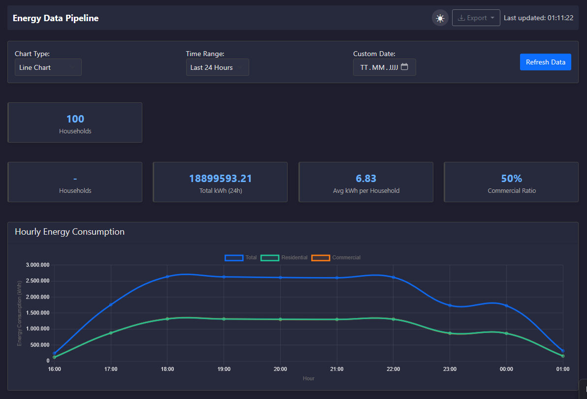

# Energy Data Processing Pipeline

A scalable data processing pipeline for energy consumption data analysis, visualization, and reporting. Can be deployed on Kubernetes or as a standalone Flask application.



## Overview

This project simulates a real-world energy data processing system that could be used by utility companies like E.ON to monitor, analyze, and visualize energy consumption patterns. The system processes energy consumption data from multiple households in real-time, providing insights through an interactive dashboard.

## Architecture

The system consists of the following components:

- **Data Generator**: Simulates IoT devices sending energy consumption data
- **RabbitMQ**: Message queue for reliable data transfer between components
- **Data Processor**: Analyzes incoming data with horizontal scaling capabilities
- **Persistent Storage**: Stores processed data for historical analysis
- **Dashboard**: Web UI with real-time visualization and data export capabilities

## Features

- **Scalable Processing**: Horizontal Pod Autoscaler automatically scales based on workload
- **Real-time Analytics**: Processes and visualizes data as it arrives
- **Interactive Dashboard**: Multiple chart types, time range selection, and filtering options
- **Dark/Light Mode**: User-friendly interface with theme support
- **Data Export**: Generate reports in CSV and PDF formats
- **Persistent Storage**: Historical data is retained across pod restarts

## Technologies Used

- **Kubernetes**: Container orchestration
- **Docker**: Containerization
- **Python**: Backend processing with Flask
- **RabbitMQ**: Message queuing
- **SQLite**: Data storage
- **Chart.js**: Data visualization
- **Bootstrap**: Responsive UI framework

## Getting Started

### Prerequisites

- Docker Desktop with Kubernetes enabled
- kubectl command-line tool
- Helm (optional)

### Deployment

1. **Clone the repository**
   ```bash
   git clone https://github.com/yourusername/energy-data-pipeline.git
   cd energy-data-pipeline
   ```

2. **Build and push Docker images**
   ```bash
   # Update with your Docker Hub username
   ./build-images.bat
   ```

3. **Deploy to Kubernetes**
   ```bash
   ./deploy.bat
   ```

4. **Access the dashboard**
   ```bash
   kubectl port-forward svc/dashboard 8081:80
   ```
   Then open your browser at http://localhost:8081

## Components Breakdown

### Data Generator

Python service that generates simulated energy consumption data for both residential and commercial properties. Consumption patterns vary by time of day to simulate real-world usage.

### Message Queue (RabbitMQ)

Provides reliable message delivery between the generator and processor, allowing the system to handle high volumes of data and ensuring no data loss during processing.

### Data Processor

Analyzes incoming energy data, calculating metrics such as:
- Total consumption by time period
- Residential vs. commercial usage ratios
- Average consumption per household
- Time-based consumption patterns

The processor automatically scales based on workload using Kubernetes' Horizontal Pod Autoscaler.

### Dashboard

Interactive web UI built with Flask, Bootstrap, and Chart.js providing:
- Real-time consumption monitoring
- Multiple visualization options (line, bar, area charts)
- Time range filtering
- Light/dark theme support
- Data export in CSV and PDF formats

## Project Structure

```
energy-data-pipeline/
├── data-generator/         # Data simulation component
│   ├── app.py
│   ├── Dockerfile
│   └── requirements.txt
├── data-processor/         # Data analysis component
│   ├── app.py
│   ├── Dockerfile
│   └── requirements.txt
├── dashboard/              # Web UI component
│   ├── app.py
│   ├── Dockerfile
│   ├── requirements.txt
│   └── templates/
│       └── index.html
├── kubernetes/             # Kubernetes configuration
│   ├── dashboard-deployment.yaml
│   ├── generator-deployment.yaml
│   ├── persistent-volume.yaml
│   ├── processor-deployment.yaml
│   └── rabbitmq.yaml
├── build-images.bat        # Script to build Docker images
├── deploy.bat              # Script to deploy to Kubernetes
└── README.md
```

## Deployment Options

### Kubernetes Deployment (What I Used)

I personally built and deployed this system using Kubernetes for container orchestration, which provides benefits like automatic scaling, self-healing, and simplified deployment. Follow the instructions in the "Getting Started" section to deploy with Kubernetes.

### Flask-only Deployment (Simpler Alternative)

If you prefer a simpler setup without Kubernetes, you can run each component directly:

1. **Set up RabbitMQ**
   ```bash
   # Using Docker
   docker run -d --name rabbitmq -p 5672:5672 -p 15672:15672 rabbitmq:3-management
   ```

2. **Run the data generator**
   ```bash
   cd data-generator
   pip install -r requirements.txt
   # Set environment variables for RabbitMQ connection
   set RABBITMQ_HOST=localhost
   set RABBITMQ_PORT=5672
   set RABBITMQ_USER=guest
   set RABBITMQ_PASS=guest
   python app.py
   ```

3. **Run the data processor**
   ```bash
   cd data-processor
   pip install -r requirements.txt
   # Create a data directory
   mkdir data
   # Set environment variables
   set RABBITMQ_HOST=localhost
   set RABBITMQ_PORT=5672
   set RABBITMQ_USER=guest
   set RABBITMQ_PASS=guest
   python app.py
   ```

4. **Run the dashboard**
   ```bash
   cd dashboard
   pip install -r requirements.txt
   python app.py
   ```
   
   Then access the dashboard at http://localhost:5000

This standalone approach is perfect for development, testing, or smaller deployments where Kubernetes might be overkill.

## Setup Instructions

### Important: Update Docker Image References

Before deploying to Kubernetes, you must update the Docker image references in the following deployment files to use your own Docker Hub username:

- `kubernetes/generator-deployment.yaml`
- `kubernetes/processor-deployment.yaml` 
- `kubernetes/dashboard-deployment.yaml`

Look for lines like these in each file and replace `${YOUR_USERNAME}` with your actual Docker Hub username:

```yaml
spec:
  containers:
  - name: data-generator
    image: ${YOUR_USERNAME}/energy-data-generator:latest
```
## Potential Enhancements

- Replace SQLite with a more robust database like PostgreSQL or TimescaleDB
- Add anomaly detection for unusual consumption patterns
- Implement user authentication and role-based access control
- Add predictive analytics for consumption forecasting
- Integrate with Grafana for more advanced monitoring capabilities

## Copyright and License

Copyright (C) 2025 Fourat Garrach

This project is licensed under the GNU General Public License v3.0 (GPL-3.0).
For more details, see the [LICENSE](LICENSE) file in this repository or visit [GNU GPL v3.0](https://www.gnu.org/licenses/gpl-3.0.en.html).  
---

For more information, contact me through [this link](https://fourat.pythonanywhere.com/contact.html)
